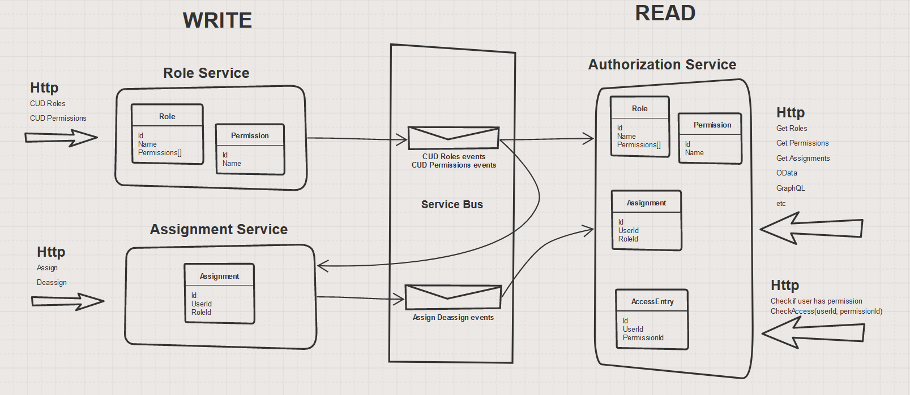
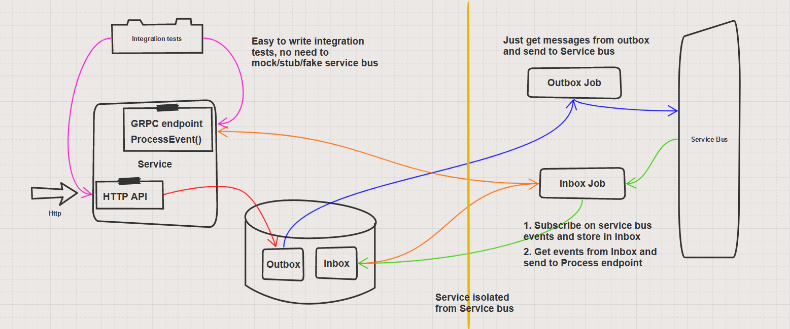
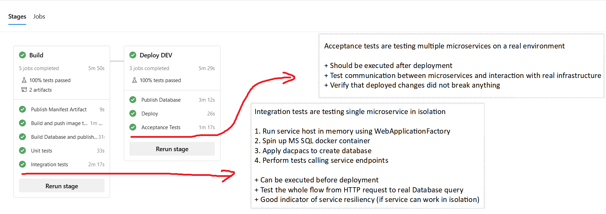

# Authorization
Sample application illustrating microservices communication using event carried state transfer and inbox/outbox patterns on example of simple permission-based authorization

Outbox and Inbox architecture

Testing approach

